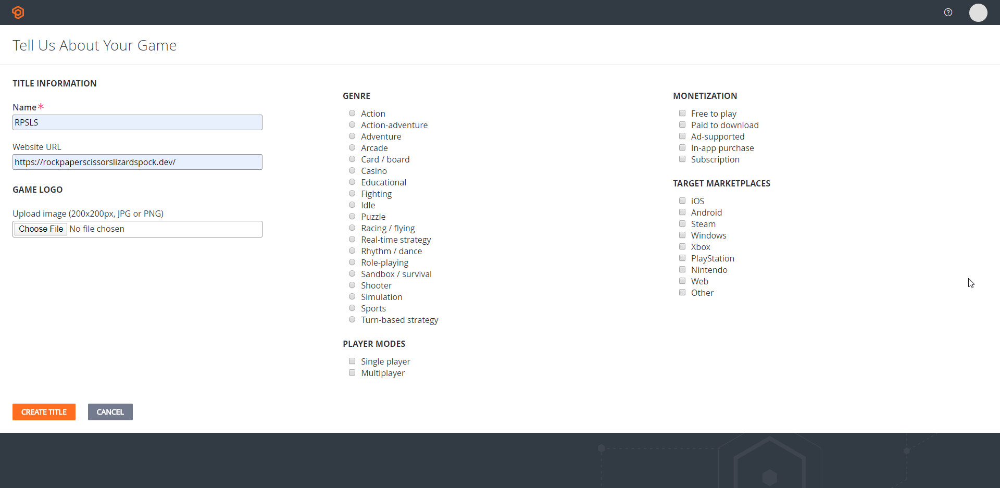
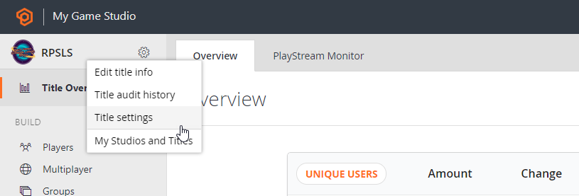
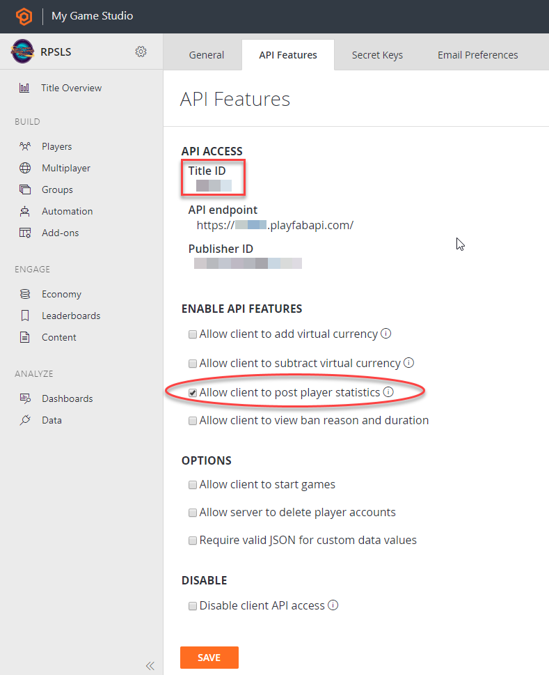
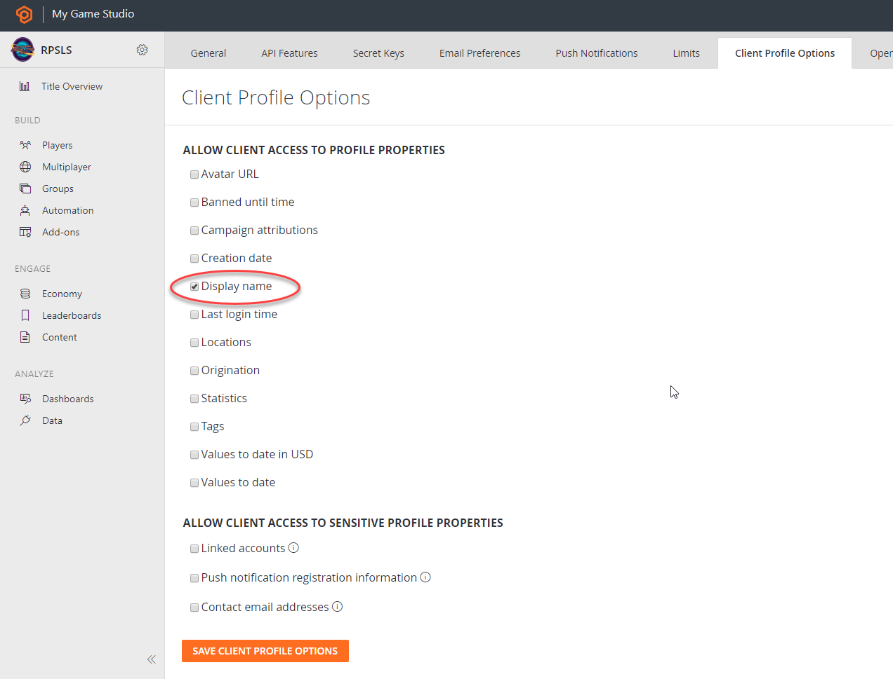

# Rock, Paper, Scissors, Lizard, Spock - Sample Multiplayer Application

Now you can enhance the game to play with a friend with the help of [Playfab platform](https://playfab.com/).
Playfab platform will be used only for the matchmaking queue logic and the leaderboard score.

## Setup
In order to support playfab you will need a playfab account with a game created (title in playfab)

1. Create a new Playfab account in the [sign up page](https://developer.playfab.com/en-us/sign-up) or if you already have one log in with it.
2. With the account creation as developer it creates a Title by default, if not create a new title. We named it RPSLS.

3. Open the title just created and navigate to title settings

4. In the API Features tab select the "Allow client to post player statistics". Required to update leaderboards and matchmaking queues from code.

5. Copy the title Id from _Api features_ tab. Go to Secret Keys tab and copy the Secret key created by default. Both parameters are required for the RPSLS game-api service configuration, we will require them in the Generate-Config.ps1 script or on local development in the docker-compose.override.yml parameters.

6. Make sure that in the "Client Profile Options" tab have the client access "Display Name" allowed. Already checked by default.

The rest of title configurations for the matchmaking queue and the Leaderboard are created directly on code.

## Playfab API Usage

The whole playfab api calls are done in the PlayFabService class, which implements the IPlayFabService interface. A short description of what each method does:

- *HasCredentials getter*: Checks for game api configuration to have Title and Secrets settings. If there isn't any configuration all multiplayer features will be deactivated.
- *Initialize*: Creates a MatchmakingQueue named `rpsls_queue` if does not exists (see https://developer.playfab.com/en-US/<titleId>/matchmaking) and two PlayerStatisticDefinition (Totals and Wins) that will result on two leaderboards. Leaderboard dashboard only shows the Wins stats, but if in the future requires another stats like win ratio or just the number of games played the stats will be already there. The queue will be configured to match users with the same token attribute. Called when game api service starts.
- *CreateTicket*: Creates a ticket on the `rpsls_queue` for a specific user. That ticket will have a data object with the user display name and a 5 characters token used to pair users.
- *CheckTicketStatus*: Checks a ticket status to see if there is a match or not. Once PlayFab finds a match it will return both players data (token and displayname) besides the opponent entity identifier. Displayname is required as there is no way to retrieve user's name from a userTitleId.
- *UpdateStats*: Fills up the user Wins and Totals stats (+1 totals and +1 on Wins stats only if it won). Both stats are configured as incremental.
- *GetLeaderboard*: Returns the Wins leaderboard.

### Matchmaking flow

There are two separated actions, creation or joining a match. The only difference is that creating a match is done with a random token and the join match has a specific token.
Both gRPC calls do the same CreateTicket and a loop with CheckTicketStatus until the ticket expires (120 seconds) or a match is found.

Beware of PlayFab api limits (https://developer.playfab.com/en-US/<titleId>/limits):
- *Ticket gets per minute* has a limit of 10 per minute on free playfab title.
- *List tickets for player per minute* has a limit of 3 per minute.

Refreshing the page or requesting several tickets can trigger those.

### Leaderboard flow

Here is as simple as both players filling up its own stats with the title client's credentials after match is over.
