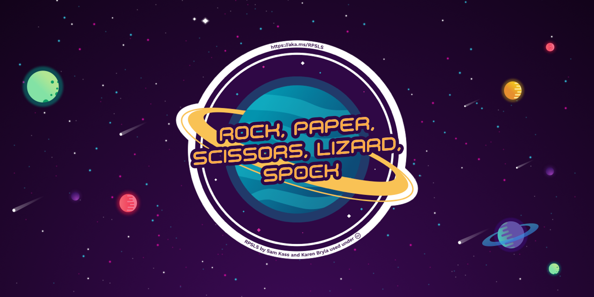
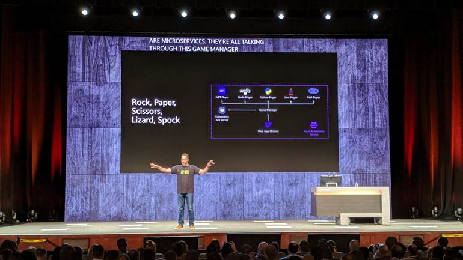
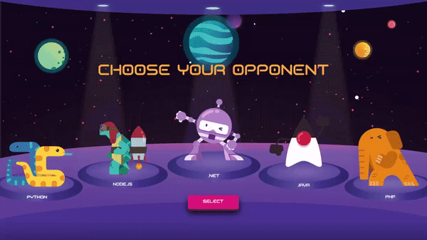
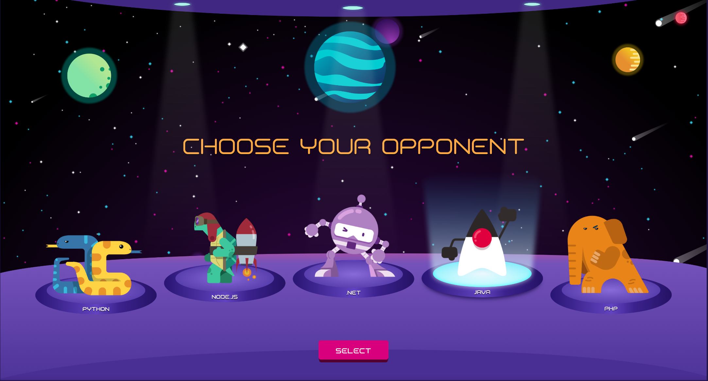
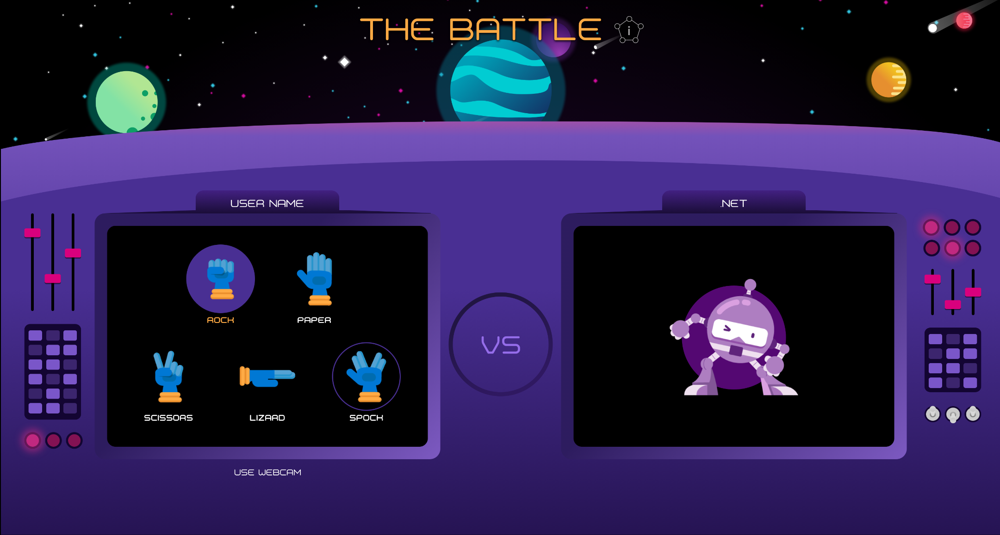
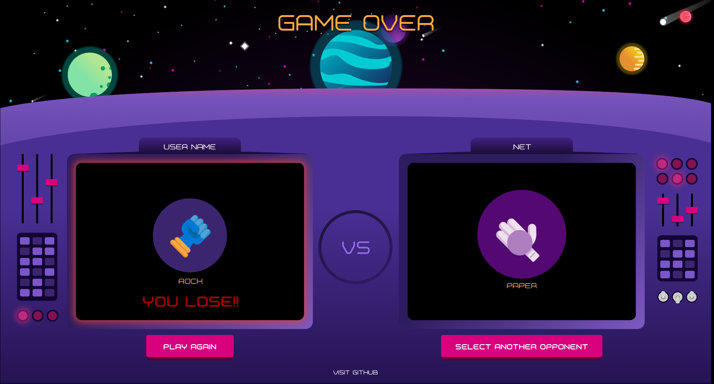
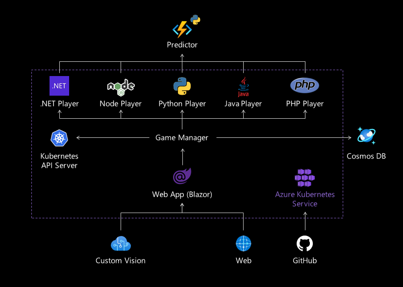
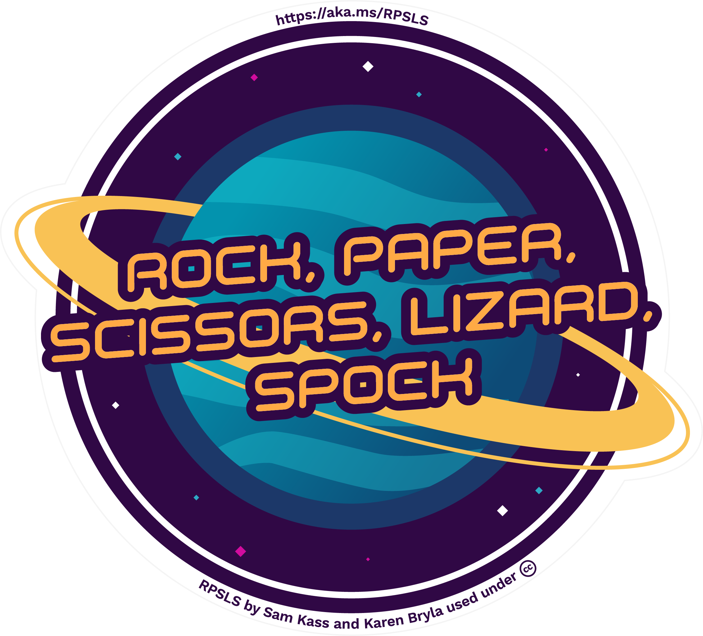
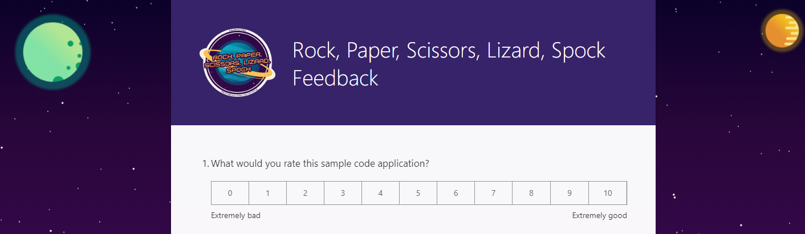

# Rock, Paper, Scissors, Lizard, Spock - Sample Application

We are happy to announce the release of Rock, Paper, Scissors, Lizard, Spock sample application running in Azure presented at [Microsoft Ignite 2019](https://aka.ms/DevKeynote) by [Scott Hanselman](https://www.hanselman.com) and friends. 



Rock, Paper, Scissors, Lizard, Spock is the geek version of the classic Rock, Paper, Scissors game. Rock, Paper, Scissors, Lizard, Spock is created by [Sam Kass and Karen Bryla.](http://www.samkass.com/theories/RPSSL.html)

The Rock, Paper, Scissors, Lizard, Spock - Sample Application shows a multilanguage application built with Visual Studio and Visual Studio Code, deployed with GitHub Actions and running on Azure Kubernetes Service (AKS). The sample application also uses Machine Learning and Azure Cognitive Services (Custom Vision API). Languages used in this application include .NET, Node.js, Python, Java, and PHP.

- Missed the keynote session? [Watch it here](https://aka.ms/devkeynote).

[](https://aka.ms/devkeynote)

- Play the game hosted in our Azure Subscription: [https://RockPaperScissorsLizardSpock.dev](https://RockPaperScissorsLizardSpock.dev)



- Get everything that you need to deploy the code and run in your subscription.

## Build Status

| [](https://github.com/microsoft/RockPaperScissorsLizardSpock/actions) | [](https://github.com/microsoft/RockPaperScissorsLizardSpock/actions) | [](https://github.com/microsoft/RockPaperScissorsLizardSpock/actions) |
| :------------- | :----------: | -----------: |
| [](https://github.com/microsoft/RockPaperScissorsLizardSpock/actions) | [](https://github.com/microsoft/RockPaperScissorsLizardSpock/actions) | [](https://github.com/microsoft/RockPaperScissorsLizardSpock/actions) |
| [](https://github.com/microsoft/RockPaperScissorsLizardSpock/actions) |


# Table of contents

- [Application Screens](#screens)
- [Application Diagram](#diagram)  
- [Getting Started](#getting-started) 
- [Deployment scenarios](#deployment-scenarios)
  - [Deploy RPSLS using one script](#deploy-unified)
  - [Deploy RPSLS step by step](#deploy-resources)
- [Swag](#Swag)
- [Feedback](#feedback)
- [Contributing](#contributing)

# <a name="screens"></a>Application Screens





# <a name="diagram"></a>Application Diagram



This a multilanguage application running on AKS with AI embedded. There are 5 bots (.NET, NodeJS, Python, Java and PHP) the user can select a language as the opponent and both, the user and the bot will have to select an object to play. The Game Manager which is a .NET API decides who wins based on the logic of the game. If the user is authenticated using Twitter the bots will call a predictor AI Model (Python Azure Function), this model learns from the selections of the objects that the user have done based on the history (stored in a Cosmos DB) to try to predict their next move. If the user is not authenticated the bots will select a random object. There is also a TensorFlow model created with Custom Vision to allow the user to play with their hands by using the webcam.

# <a name="getting-started"></a>Getting Started

## Pre-Requisites

1. You will need [Visual Studio 2019](https://visualstudio.microsoft.com/vs/) on Windows 10.
1. You will need [Docker Desktop](https://www.docker.com/products/docker-desktop).

If you want to deploy this solution in Azure:

1. You will need and Azure Subscription in order to deploy this.
1. Azure CLI.
1. Download and install helm.

## New to Microsoft Azure?

You will need an Azure subscription to work with this demo code. You can:

- Open an account for free [Azure subscription](https://azure.microsoft.com/free/). You get credits that can be used to try out paid Azure services. Even after the credits are used up, you can keep the account and use free Azure services and features, such as the Web Apps feature in Azure App Service.
- [Activate Visual Studio subscriber benefits](https://azure.microsoft.com/pricing/member-offers/credit-for-visual-studio-subscribers/). Your Visual Studio subscription gives you credits every month that you can use for paid Azure services.
- Create an [Azure Student Account](https://azure.microsoft.com/free/students/) and get free credit when you create your account.

Learn more about it with [Microsoft Learn - Introduction to Azure](https://docs.microsoft.com/learn/azure).


# <a name="deployment-scenarios"></a>Deploy to Azure

You can either go through all steps and customizing its configuration or run one single command.

## <a name="deploy-unified"></a>Deploy RPSLS using one script

Execute the script located in Deploy folder with the following parameters:
```
.\Deploy-Unified.ps1 -resourceGroup <resource-group-name> -location <location> -clientId <service-principal-id> -password <service-principal-password> -subscription <subscription-id>
```

- `resourceGroup`: The name of your resource group where all infrastructure will be created `Required`
- `location`: Select where you want to create your resource group, for example: `eastus` `Required`
- `clientId`: Id of the service principal used to create the AKS `Optional`
- `password`: Password of the service principal `Optional`
- `subscription`: Id of your subscription where you are going to deploy your resource group `Required`

If service principal credentials are not passed a new one will be created.

## <a name="deploy-resources"></a>Deploy RPSLS step by step

To run RPSLS you need to create the Azure infrastructure. There are two ways to do it. Using Azure portal or using a Powershell script.

### <a name="create-infrastructure-portal"></a>Step 1 - Option 1: Creating infrastructure using Azure Portal

An ARM template is provided so you can create the whole infrastructure required for RPSLS

[](https://portal.azure.com/#create/Microsoft.Template/uri/https%3A%2F%2Fraw.githubusercontent.com%2FMicrosoft%2FRockPaperScissorsLizardSpock%2Fmaster%2FDeploy%2Farm%2Fdeployment.json)

- `servicePrincipalId`: Id of the service principal used to create the AKS `Required`
- `servicePrincipalSecret`: Password of the service principal `Required`
- `aksVersion`: AKS version to use. `Required`

The deployment could take more than 10 minutes, and once finished all needed resources will be created.

### <a name="create-infrastructure-cli"></a>Step 1 - Option 2: Create the resources using the CLI

You can use the CLI to deploy the ARM script. Open a Powershell window from the `/Deploy` folder and run the `Deploy-Arm-Azure.ps1` with following parameters:

- `-resourceGroup`: Name of the resource group `Required`
- `-location`: Location of the resource group `Required if resourceGroup does not exist`
- `-clientId`: Id of the service principal used to create the AKS `Optional`
- `-password`: Password of the service principal `Optional`

If service principal credentials are not passed a new one will be created.

Once script finishes, everything is installed. If a service principal has been created, the script will output the service principal details - _please, take note of the appId and password properties for use them in the AKS deployment_

### <a name="deploy-aks"></a>Step 2: Deploy RPSLS on AKS

Pre-requisites for this deployment are to have:

- The AKS and all related resources deployed in Azure
- A terminal with Powershell environment
- [Azure CLI 2.0](https://docs.microsoft.com/en-us/cli/azure/install-azure-cli?view=azure-cli-latest) installed.
- [Azure Functions Core Tools](https://docs.microsoft.com/es-es/azure/azure-functions/functions-run-local) installed (required only to deploy Predictor).
- [Kubectl](https://kubernetes.io/docs/tasks/tools/install-kubectl/) installed with the last version (v1.16.0 at this moment).
- [Helm 3](https://helm.sh/docs/intro/install/) installed with 3.0 or superior version (v3.0.0 at this moment).
- Docker installed

#### Service Principal

A Service Principal is needed for creating the AKS. If you use the [CLI for create the resources](#create-infrastructure-cli). You need the client id and password of a Service Principal to install RPSLS.

In case you use [Azure Portal for the resources' creation](#create-infrastructure-portal), you can also reuse a SP or create manually a new one for passing the credentials to the template.

#### Connecting kubectl to AKS

From the terminal type:

- `az login` and follow instructions to log into your Azure.
- If you have more than one subscription type `az account list -o table` to list all your Azure subscriptions. Then type `az account set --subscription <subscription-id>` to select your subscription
- `az aks get-credentials -n <your-aks-name> -g <resource-group-name>` to download the configuration files that `kubectl` needs to connect to your AKS.

At this point if you type `kubectl config current-context` the name of your AKS cluster should be displayed. That means that `kubectl` is ready to use your AKS

### Installing FlexVolume

The KeyVault support is implemented through [FlexVol](https://github.com/Azure/kubernetes-keyvault-flexvol). To install Flex Volume in the AKS, type the following:

```
.\Create-Kv-FlexVolume.ps1
```
#### Publish Python Azure Function

To publish the Azure Function you can execute the next command of the Azure Functions Core Tools from the folder `/Source/Functions/RPSLS.Python.Api`:
```
func azure functionapp publish <funcapp-name> --no-build
```
The value for `funcapp-name` must be the name of the Function App created in your Azure Resource Group.

#### Configuring services

Before deploying services using Helm, you need to setup the configuration. We refer to the configuration file with the name of _gvalues_ file. This file **contains all secrets** so beware to not commit in your repo accidentally.

A template of this file is in `powershell/gvalues.template`. The deployment scripts use this file by default, **but do not rely on editing this file**. Instead create a copy of it a folder outside the repository and use the `-valuesFile` parameter of the deployment script.

> **Note:** The folder `/Deploy/helm/__values/` is added to `.gitignore`, so you can keep all your configuration files in it, to avoid accidental pushes.

Please refer to the comments of the file for its usage.

##### Auto generating the configuration file

Generating a valid _gvalues_ file can be a bit harder, so there is a Powershell script that can do all work by you. This script assumes that all resources are deployed in the same resource group, and this resource group contains only the RPSLS resources. Also assumes the Azure resources have been created using the **tools provided in this repo**.

> **Note** The Generate-Config.ps1 uses the _application-insights_ CLI extension to find the application insights id. Install it with `az extension add --name application-insights`

> **Note** The configuration script requires the Azure function key so internal aks services can call it. So before executing the Generate-Config.ps1 make sure that the function is already published and the function key exists. 

To auto-generate your _gvalues_ file just go to `/Deploy/powershell` folder and from a Powershell window, type the following:

```
.\Generate-Config.ps1 -resourceGroup <your-resource-group> -outputFile ..\helm\__values\<name-of-your-file>
```

The `Generate-Config.ps1` script accepts so many parameters. [Here](./Deploy/powershell/readme.md#Generate-Config) you can find a list of them all.

The script checks that all needed resources exists in the resource group. If some resource is missing or there is an unexpected resource, the script exits.

#### Build & deploy images to ACR

You can **manually use docker-compose** to build and push the images to the ACR. If using compose you can set following environment variables:

- `TAG`: Will contain the generated docker images tag
- `REGISTRY`: Registry to use. This variable should be set to the login server of the ACR

Once set, you can use `docker-compose build` and `docker-compose push` to build and push the images.

Additionally there is a Powershell script in the `Deploy` folder, named `Build-Push.ps1`. You can use this script for building and pushing ALL images to ACR. Parameters of this script are:

- `resourceGroup`: Resource group where ACR is. **Required**.
- `acrName`: ACR name (not login server). **Required**.
- `dockerTag`: Tag to use for generated images (defaults to `latest`)
- `dockerBuild`: If `$true` (default value) docker images will be built using `docker-compose build`.
- `dockerPush`: If `$true` (default value) docker images will be push to ACR using `docker-compose push`.

This script uses `az` CLI to get ACR information, and then uses `docker-compose` to build and push the images to ACR.

To build and push images tagged with v1 to a ACR named my-acr in resource group named my-rg, execute the following command inside `/Deploy/powershell`

```
.\Build-Push.ps1 -resourceGroup my-rg -dockerTag v1 -acrName my-acr
```

To just push the images (without building them before):

```
.\Build-Push.ps1 -resourceGroup my-rg -dockerTag v1 -acrName my-acr -dockerBuild $false
```

#### Deploying services

You need to use Powershell and run `./Deploy-Images-Aks.ps1`. A typical call is:

```ps
.\Deploy-Images-Aks.ps1 -resourceGroup $resourceGroup -aksName $myAks -acrName $myAcr -valuesFile $myValuesFilePath -tag v1
```

**Note**: Read the [documentation of this script](./Deploy/powershell/readme.md) for a list of all parameters.

This script will install all services using Helm and your custom configuration from the configuration file set by `-valuesFile` parameter.

The parameter `charts` allow for a selective installation of charts. Is a list of comma-separated values that mandates the services to deploy in the AKS. Values are:

- `cs` C# Player.
- `nj` NodeJS Player.
- `py` Python Player.
- `php` PHP Player.
- `jv` Java Player.
- `web` Website
- `gm` Game Manager

# Swag

We distributed some swag after the keynote session at Ignite (t-shirts, stickers and pins) but we had a limited amount so it made sense to open up the logo for swag.

<a href="Documents/Swag/logo.png"><br/></a>

# Feedback

[Help us improve this sample application with your valuable feedback by filling up this survey.](https://forms.office.com/Pages/ResponsePage.aspx?id=v4j5cvGGr0GRqy180BHbRyg-YAZ0zypKmtaBgQnPt0tUNElFSkhLUFhZUzJEQzdPWUFLR0Y1R1VWTCQlQCN0PWcu)

[](https://forms.office.com/Pages/ResponsePage.aspx?id=v4j5cvGGr0GRqy180BHbRyg-YAZ0zypKmtaBgQnPt0tUNElFSkhLUFhZUzJEQzdPWUFLR0Y1R1VWTCQlQCN0PWcu)

[If you prefer you can also send us an email with your feedback](mailto:f99f7b8d.microsoft.com@amer.teams.ms).

# <a name="contributing"></a>Contributing

This project welcomes contributions and suggestions. Most contributions require you to agree to a
Contributor License Agreement (CLA) declaring that you have the right to, and actually do, grant us
the rights to use your contribution. For details, visit https://cla.microsoft.com.

When you submit a pull request, a CLA-bot will automatically determine whether you need to provide
a CLA and decorate the PR appropriately (e.g., label, comment). Simply follow the instructions
provided by the bot. You will only need to do this once across all repos using our CLA.

This project has adopted the [Microsoft Open Source Code of Conduct](https://opensource.microsoft.com/codeofconduct/).
For more information see the [Code of Conduct FAQ](https://opensource.microsoft.com/codeofconduct/faq/) or
contact [opencode@microsoft.com](mailto:opencode@microsoft.com) with any additional questions or comments.
